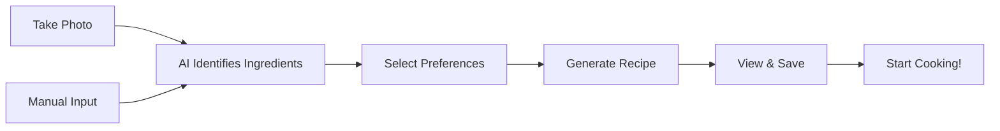

<div align="center">

# 🍽️ NUTRISNAP
### AI-Powered Recipe Generator Mobile App

[](https://reactnative.dev/)
[](https://www.typescriptlang.org/)
[](https://expo.dev/)

**Smart Recipes** • **Ingredient Scanner** • **Personalized Cooking**

---

</div>

## 📖 Overview

SmartCooking is an intelligent mobile application that transforms the way you cook by generating personalized recipes based on ingredients you already have. Simply snap a photo of your ingredients or manually input them, and let AI create delicious recipes tailored to your dietary preferences and available cooking time.

### ✨ Key Highlights

- 📸 **Ingredient Scanner** - Take photos of ingredients for instant recipe suggestions
- 🤖 **AI-Powered Recipes** - GPT-4 generates creative, personalized recipes
- 🥗 **Dietary Customization** - Support for vegetarian, vegan, gluten-free, and more
- 💾 **Save Favorites** - Bookmark recipes for quick access later
- 📊 **Nutritional Info** - View estimated calories and macros for each recipe
- 🕐 **Time-Based Filtering** - Find recipes that match your available cooking time
- 📱 **Cross-Platform** - Works seamlessly on iOS and Android
- 🌙 **Beautiful UI** - Modern, intuitive interface with smooth animations

## 🎯 How It Works



### User Flow

1. **Add Ingredients**
   - Scan ingredients using your camera
   - Or manually enter what you have

2. **Set Your Preferences**
   - Choose dietary restrictions
   - Set number of servings
   - Select available cooking time

3. **Generate Recipe**
   - AI analyzes your inputs
   - Creates a custom recipe just for you

4. **Cook & Enjoy**
   - Follow step-by-step instructions
   - Save recipes you love
   - Share with friends and family

## 🛠️ Tech Stack

### Frontend
- **React Native** - Cross-platform mobile framework
- **TypeScript** - Type-safe JavaScript
- **Expo** - Development and build tooling
- **React Navigation** - Screen routing and navigation

### State Management & Storage
- **React Context API** - Global state management
- **AsyncStorage** - Local data persistence
- **Expo SecureStore** - Secure credential storage

### Media & Camera
- **Expo Camera** - Camera access and photo capture
- **Expo ImagePicker** - Gallery access
- **Expo FileSystem** - File management

### Backend Integration
- **Axios** - HTTP client for API requests
- **REST API** - Communication with Flask backend
- Custom API wrapper with error handling

### UI/UX
- **React Native Paper** - Material Design components
- **Vector Icons** - Icon library
- **Custom Animations** - Smooth transitions and effects

## 🚀 Quick Start

### Prerequisites

Ensure you have the following installed:
- Node.js (v16 or higher)
- npm or yarn
- Expo CLI (`npm install -g expo-cli`)
- iOS Simulator (Mac only) or Android Studio
- Git

### Installation

1. **Clone the repository**
```bash
git clone https://github.com/Boredoom17/SmartCooking.git
cd SmartCooking/SmartCookingStable
```

2. **Install dependencies**
```bash
npm install
# or
yarn install
```

3. **Configure environment variables**
   
   Create a `.env` file in the root directory:
```env
API_URL=http://your-backend-url:5000
EXPO_PUBLIC_API_URL=http://your-backend-url:5000
```

4. **Start the development server**
```bash
npm start
# or
expo start
```

5. **Run on your device**
   - **iOS**: Press `i` in the terminal or scan QR code with Camera app
   - **Android**: Press `a` in the terminal or scan QR code with Expo Go app
   - **Web**: Press `w` (limited functionality)

## 📱 Running on Physical Devices

### iOS (Requires Mac)

1. **Install Expo Go** from the App Store
2. **Scan the QR code** displayed in the terminal with your Camera app
3. **Open in Expo Go** when prompted

### Android

1. **Install Expo Go** from the Play Store
2. **Scan the QR code** displayed in the terminal with the Expo Go app
3. **App will load** automatically

### Development Build (Recommended for Full Features)

```bash
# For iOS
eas build --profile development --platform ios

# For Android
eas build --profile development --platform android
```

## 🗂️ Project Structure
```
SmartCooking/
├── SmartCookingStable/
│   ├── app/                    # App screens and navigation
│   │   ├── (tabs)/            # Tab-based navigation
│   │   │   ├── index.tsx      # Home screen
│   │   │   ├── recipes.tsx    # Saved recipes
│   │   │   └── profile.tsx    # User profile
│   │   ├── recipe/            # Recipe details
│   │   └── _layout.tsx        # Root layout
│   ├── components/             # Reusable components
│   │   ├── RecipeCard.tsx
│   │   ├── IngredientInput.tsx
│   │   └── CameraScanner.tsx
│   ├── services/              # API and utilities
│   │   ├── api.ts             # Backend integration
│   │   └── storage.ts         # Local storage
│   ├── types/                 # TypeScript definitions
│   ├── assets/                # Images, fonts, etc.
│   ├── constants/             # App constants
│   ├── hooks/                 # Custom React hooks
│   ├── app.json               # Expo configuration
│   ├── package.json           # Dependencies
│   ├── tsconfig.json          # TypeScript config
│   └── .env.example           # Environment template
└── README.md                  # This file
```

## 🎨 Key Features in Detail

### 📸 Ingredient Scanner
- Uses device camera to capture ingredient photos
- AI-powered image recognition identifies ingredients
- Automatic addition to ingredient list
- Manual editing and refinement options

### 🤖 Smart Recipe Generation
- GPT-4 analyzes available ingredients
- Considers dietary restrictions and preferences
- Provides detailed cooking instructions
- Includes prep time, cook time, and serving sizes

### 💾 Recipe Management
- Save favorite recipes locally
- Quick access to saved recipes
- Delete unwanted recipes
- Share recipes with friends

### 🥗 Dietary Preferences
- Vegetarian
- Vegan
- Gluten-Free
- Dairy-Free
- Keto
- Low-Carb
- Custom restrictions

### 📊 Nutritional Information
- Estimated calories per serving
- Macronutrient breakdown (protein, carbs, fats)
- Dietary fiber content
- Allergen warnings

## ⚙️ Configuration

### Backend Connection

Update your API URL in `.env`:
```env
API_URL=https://your-production-backend.com
```

### Camera Permissions

The app requires camera permissions for ingredient scanning. These are requested at runtime.

**iOS:** Permissions are handled automatically
**Android:** Permissions are declared in `app.json`

### Build Configuration

Edit `app.json` for build settings:
```json
{
  "expo": {
    "name": "SmartCooking",
    "slug": "smart-cooking",
    "version": "1.0.0",
    "ios": {
      "bundleIdentifier": "com.yourname.smartcooking"
    },
    "android": {
      "package": "com.yourname.smartcooking"
    }
  }
}
```

## 🚢 Building for Production

### Create Production Builds

1. **Set up EAS Build**
```bash
npm install -g eas-cli
eas login
eas build:configure
```

2. **Build for iOS**
```bash
eas build --platform ios --profile production
```

3. **Build for Android**
```bash
eas build --platform android --profile production
```

### Submit to App Stores

```bash
# iOS App Store
eas submit --platform ios

# Google Play Store
eas submit --platform android
```

## 📲 App Store Presence

### iOS App Store
- Coming soon!

### Google Play Store
- Coming soon!

## 🔒 Security & Privacy

- ✅ Secure API communication (HTTPS in production)
- ✅ No personal data collected without consent
- ✅ Camera access only when needed
- ✅ Local storage for saved recipes
- ✅ No third-party analytics by default
- ✅ Open source and transparent

**Privacy First:** Your ingredient photos are processed only for recipe generation and not stored on servers.

## 🤝 Contributing

Contributions are welcome! To contribute:

1. Fork the repository
2. Create a feature branch
```bash
git checkout -b feature/amazing-feature
```
3. Commit your changes
```bash
git commit -m "Add amazing feature"
```
4. Push to your branch
```bash
git push origin feature/amazing-feature
```
5. Open a Pull Request

## 🐛 Known Issues

- Camera may not work on iOS Simulator (use physical device)
- Some fonts may not load on first app start
- Image scanning requires good lighting for best results

Found a bug? [Open an issue](https://github.com/Boredoom17/SmartCooking/issues)

## 📈 Roadmap

- [ ] **v1.1** - Meal planning calendar
- [ ] **v1.2** - Shopping list generation
- [ ] **v1.3** - Recipe sharing community
- [ ] **v2.0** - Video cooking tutorials
- [ ] **v2.1** - Voice-guided cooking mode
- [ ] **v2.2** - Integration with smart kitchen devices
- [ ] **v2.3** - Multi-language support
- [ ] **v3.0** - Social features and recipe ratings

## 🧪 Testing

### Run Tests
```bash
npm test
# or
yarn test
```

### E2E Testing
```bash
# Coming soon - Detox integration planned
```

## 📄 License

This project is licensed under the MIT License - see the [LICENSE](LICENSE) file for details.

## 👨‍💻 Developer

**Aadarsha Chhetri**
- GitHub: [@Boredoom17](https://github.com/Boredoom17)
- Frontend Repository: [SmartCooking Mobile App](https://github.com/Boredoom17/SmartCooking)
- Backend Repository: [SmartCooking API](https://github.com/Boredoom17/smartcooking-flask-backend)

## 🙏 Acknowledgments

- **OpenAI** - GPT-4 and Vision API
- **Expo Team** - Excellent development tools
- **React Native Community** - Comprehensive libraries
- **All beta testers** - Valuable feedback and support

## 📞 Support

Need help? Here's how to get support:

- 📧 Open an [issue](https://github.com/Boredoom17/SmartCooking/issues)
- 📖 Check the [documentation](https://github.com/Boredoom17/SmartCooking#readme)
- 🔧 Backend API: [Flask Backend](https://github.com/Boredoom17/smartcooking-flask-backend)
- 💬 Reach out via GitHub Discussions

## 🌟 Star History

If you find this project helpful, please consider giving it a star! ⭐

## 📸 Screenshots

*Coming soon - App screenshots will be added here*

---

<div align="center">

**⭐ Star this repo if you found it helpful!**

Made with ❤️ for smarter, easier cooking

[📱 Mobile App](https://github.com/Boredoom17/SmartCooking) • [🔧 Backend API](https://github.com/Boredoom17/smartcooking-flask-backend) • [🐛 Report Bug](https://github.com/Boredoom17/SmartCooking/issues) • [✨ Request Feature](https://github.com/Boredoom17/SmartCooking/issues)

</div>
